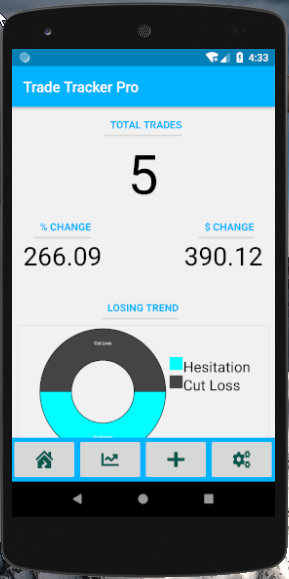
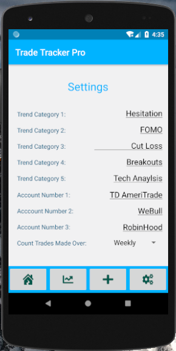
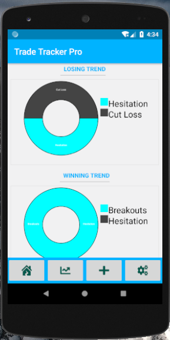
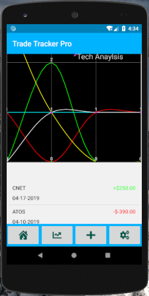
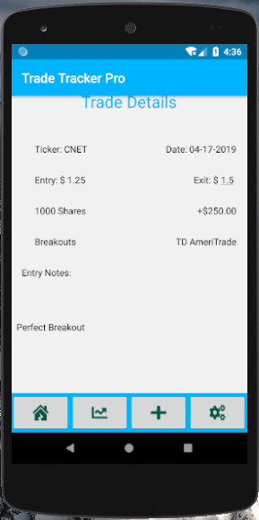
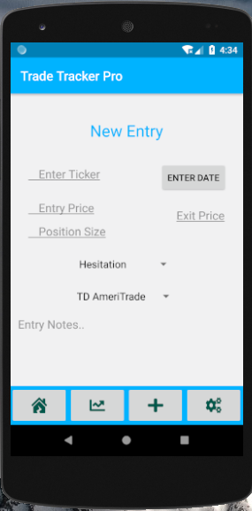

# Trade Tracker Pro

Trade tracker pro is an Android application that allows retail traders to keep a log of their current and past trades.
By identifying trends the trader can become more successful and avoid repeating the same mistakes over and over again.
With T.T.P the trader can:

- Quickly View Past Trades
- Set 5 Outcome Categories to keep track of trends
- Set 3 Different Brokerage Accounts
- Exported Their Entire Journal To a CSV file
- Get Reminders to Enter New Trade Logs
- Quickly Detect which Categories are Winners and Which are Losers
- View Daily, Weekly or Monthly Snapshots

T.T.P does not require any permissions to use. 

## Getting Started

After installing TTP your first stop should be to the settings screen. Here you can fill out all the account specific details.
You should come up with 5 Categories and set your snapshot interval.

#### Categories

Try to think of at least 2 common trends that you believe help you make an successful trade. On that same note, try to think of 
2 common trends that you believe help you make a **unsuccessful** trade.  Examples include:

- Fear of Missing Out
- Not Cutting Losses
- Timing
- Buying the Dip
- Hesitation
- And so on...

These 5 Categories will become the pillar of your log. Please try not to change these as changes may not be reflected until you enter enough trades to get a good sampling section. Likewise, you can always delete the entries that contain your old category but you still have to build up enough data for the charts to work properly with your new category.

## Home Screen

When you first open TTP you will find 5 different widgets. From top to bottom these are:
- Total trades Counter
- Percent Change 
- Net Change
- Losing Trend Chart
- Winning Trend Chart

The total trades counter will count the number of trades made over your specified time period. For example, if you set it Weekly, then TTP will count the number of trades you have made over the last week. Useful for monitoring your trading activity. Are you trading too much or too little?

The Percent Change and Net Change will show you how much your portfolio has changed over the specified time period. It is calculated from the total amount of your portfolio minus your time periods change. For example, if you set it Weekly, then TTP will tell you the percent gain or loss you have incurred over the last week. Please note: When first using TTP percent change is calculated from 0 because your initial portfolio is 0.

The losing trend chart will show you the top 2 losing categories. For example, if you have two categories named Buying the Dip and Not Cutting losses then TTP will go through all your previous trades and if these 2 categories show the biggest losses then TTP will show you how much each category represents in your total trades.

The winning trend chart will do exactly the opposite of the losing trend chart.

## Performance Screen

The Performance screen will display a line chart containing all 5 categories and a list of all your past trades. You can easily view each trade by pressing on it. 

The line chart represents all the occurrences of your categories in the last 4 periods (Each period corresponds to your time setting: Daily, Weekly, Monthly). This chart will allow you to visualize which categories your improving on and which categories you need to work more on. For example, if you are in a bad habit of not cutting losses early, then you will see if that pattern is getting better or worse.

The list of all your previous trades will be shown below the chart. By pressing on the line item you would like to view TTP will show you the details of that specific entry. This is useful for finding out why you entered a specific trade or maybe why you exited when you did.

## Trade Details Screen

The trade details screen will display the specifics of the trade you selected. Here you can find Entry and Exit prices, Shares, Net Change, Entry and Exit Notes as well as the day you made the trade. 

If you did not enter an exit price or an exit note you can now enter those through this screen. Say you just wanted to enter a log entry the moment you entered a trade, well your exit price and exit notes would have nothing because the trade is still active. Here you find that specific trade and enter the exit details when you decide to exit.

You can also delete entries from the details screen. Simply scroll to the bottom and hit the delete button. If you make an error that you catch later on, you will have to delete the entry and enter a new one.

## New Entry Screen

The new entry screen will display a form that will be your log entry. This is the meat and potatoes of TTP. It’s very important to enter trades daily, so TTP can give you the most current information regarding your trading habits. 

#### Required:
- Ticker 
- Date
- Entry Price
- Total Position Size
- Outcome Category
- Account
- Entry Notes

## Optional:
- Exit Price
- Exit Description

## Settings

The settings screen is where you can personalize TTP. Here you can enter all 5 categories, up to 3 different accounts, and set your time interval. Please make sure you set your categories appropriately.

You have the ability to enter up to 3 different brokerage accounts. You can use the actual account number, the broker, or whatever naming system you like best. This simply helps you identify trades you may have made with different accounts.

When selecting a time interval please bear in mind the frequency in which you are trading. If you’re a day trader than a daily interval will give you a snapshot of the past week. If you would like a longer snapshot, use the weekly interval. That would give you a snapshot of the last 4 weeks. Lastly, if you like to buy and hold, then the monthly interval is probably best, giving you a snapshot of the last 4 months. At any point in time you are able to change this setting and the changes a reflected instantly.
